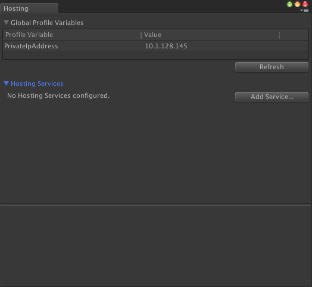
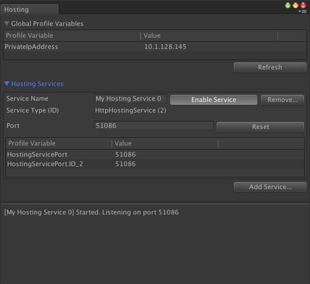
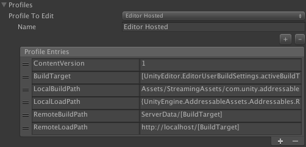
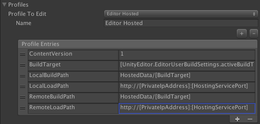
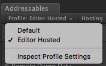
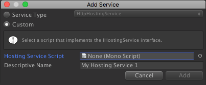

# Asset Hosting Services

## Overview

Hosting Services provide an integrated facility for serving packed content, based on the Addressable Assets configuration data, to local or network connected Unity Player builds from within the Unity Editor. Hosting Services are designed to improve iteration velocity when testing packed content, and can also be used to serve content to connected clients on local and remote networks.

### Packed Mode Testing and Iteration

Moving from Editor playmode testing to platform Player build testing introduces complexities, and time costs, to the development process. Hosting Services provide extensible Editor-embedded content delivery services that map directly to the Addressables group configuration. Using a custom Addressables Profile, you can quickly configure your application to load all content from the Unity Editor itself. This includes Unity Player builds deployed to mobile devices, or any other platform, that have network access to your development system.

### Turn-key Content Server

You can deploy Asset Hosting Services into a server environment by running in batch mode (headless) to host content for both intranet and internet facing Unity Player clients.

## Setup

This guide walks you through the initial setup of Hosting Services for your project. While the content focuses on Editor workflows, you can use the  Addressables API to configure Hosting Services by setting the `HostingServicesManager` property of the `AddressableAssetSettings` class.

### Create and Configure a new Hosting Service

Use the __Hosting__ window to add, configure, and enable new Hosting Services. To access the __Hosting__ window, from the toolbar select __Window__ > __Asset Management__ > __Hosting Services__ or from the __Hosting__ button in the main Addressables window.

To add a new Hosting Service, click the __Add Service__ button.

In the __Add Service__ dialog, you can select a predefined service type or define a custom service type. To use a predefined service type, select __Service Type__, then the service type from the associate drop-down menu. In the __Descriptive Name__ field enter a name for the service. In the example shown above, we added the *HttpHostingService* service. For more details on implementing custom hosting service types, see [Custom Services](#custom-services).

After adding the service, it appears in the __Hosting Services__ section of the __Hosting__ window, and is initially in the _disabled_ state. To start the service, click the __Enable Service__ button.

The HTTP hosting service automatically assigns a port number when it starts. The port number is saved and reused between Unity sessions. To choose a different port, either assign a specific port number in the __Port__ field, or use the __Reset__ button to randomly select a different port.

__Note__: If the port number is reset, you must perform  full player build to generate and embed the correct URL.

The HTTP hosting service is now enabled and ready to serve content from the directory specified in the `BuildPath` of each Asset Group.

### Profile Setup

The recommended pattern for working with Hosting Services during development is to create a profile that configures all Asset Groups to load content from the hosting service from a directory or directories created specifically for that purpose.

From the Addressables window, select  __Inspect Profile Settings__ from the Profiles drop-down, or find and select the *AddressableAssetSettings* object for inspection.

Next, create a new Profile. In this example it is called "Editor Hosted".

Now modify all variables used for loading paths (such as `LocalLoadPath` and `RemoteLoadPath` in this example) to instead load from the hosting service. With HttpHostingService, this is a URL that uses the local IP address and the port assigned to the service. From the Hosting Services window, you can use the Profile Variables named `PrivateIpAddress` and `HostingServicePort` to construct the url. e.g. `http://[PrivateIpAddress]:[HostingServicePort]`

Additionally, modify all variables used for build paths (such as `LocalBuildPath` and `RemoteBuildPath`) to point to a common directory outside of the project `Assets` folder.

Verify that each group is configured correctly. Ensure that the `BuildPath` and `LoadPath` are set to their respective profile keys modifed for use with Hosting Services. In this example you can see how the profile variables within the `LoadPath` are expanded to build a correct base URL for loading from Hosted Services.

Finally, select the new profile from the Addressables window, create a build, and deploy to the target device. The Unity Editor now serves all load requests from the player through the HttpHostingService. You can now make additions and changes to content without redeployment - rebuild the Addressable content, and relaunch the already deployed player to refresh the content.

### Batch Mode

You can also use Hosting Services to serve content from the Unity Editor running in batch mode.

Launch Unity from the command line with the following options:
`-batchMode -executeMethod UnityEditor.AddressableAssets.HostingServicesManager.BatchMode`

This loads the Hosting Services configuration from the default AddressableAssetSettings object, and start all configured services.

To use an alternative AddressableAssetSettings configuration, create your own static method entry point, and call through to `UnityEditor.AddressableAssets.HostingServicesManager.BatchMode(AddressableAssetSettings settings)` overload.

## Custom Services

Hosting Services is designed to be extensible, allowing you to implement your own custom logic for serving content loading requests from the Addressables system. Example use cases:
* Support a custom `IResourceProvider` that uses a non-HTTP protocol for downloading content.
* Manage an external process for serving content that matches your production CDN solution - e.g. Apache HTTP server.

### Implement IHostingService

The HostingServicesManager can manage any class that implements `IHostingService`. See the [API documentation](../api/UnityEditor.AddressableAssets.IHostingService.html) for for details on method parameters and return values.

### Add a Custom Service

From the `Add Service` dialog, select `Custom` and drag-and-drop the script into place, or select from the object picker. The dialog verifies that the selected script implements the `IHostingService` interface. To finish adding the service, click the `Add` button. In the future, your custom implementation will show up in the `Service Type` drop-down menu.

